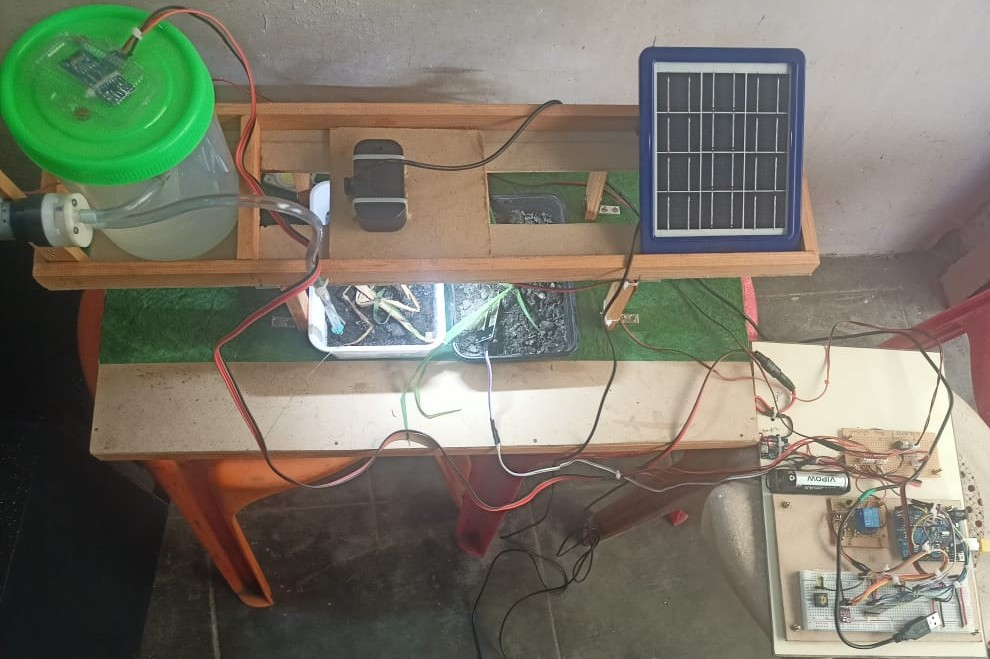

# Intelligent Pesticide Sprinkling System (SIH 2025)

**Team:** Eternal Minds | **Problem Statement ID:** 25015  
**Theme:** Agriculture, Food Tech & Rural Development | **Category:** Hardware

## 🚀 Project Overview
Traditional pesticide spraying leads to chemical waste and environmental damage. Our system uses **Edge AI (InceptionV3)** to identify specific plant diseases and pests in real-time. It then calculates the precise dosage required and triggers a targeted sprayer via a rail-mounted system.

## ✨ Key Features
- **AI Disease Detection:** GoogLeNet InceptionV3 model with >93% accuracy.
- **Smart Rule Engine:** Automatically scales pesticide dosage based on infection severity.
- **Solar Powered:** Sustainable, off-grid operation with MPPT charging.
- **Multi-Sensor Monitoring:** Tracks soil moisture, temperature, and humidity.
- **Offline Capable:** Designed to work in rural areas without internet.

## 🛠️ System Architecture
The project is divided into three modules:
1. **Vision Module (ESP32-CAM):** Captures images and handles rail navigation.
2. **Analysis Module (Python/TensorFlow):** Processes images using the trained model.
3. **Control Module (Arduino Uno):** Manages sensors and triggers the pesticide pump.

## 📂 Repository Structure
- `/firmware`: C++ code for Arduino Uno and ESP32-CAM.
- `/ml_logic`: Python scripts for model training and live analysis.
- `/assets`: Circuit diagrams, architecture maps, and prototype photos.

## 📊 AI Model Details
- **Architecture:** InceptionV3 (Transfer Learning).
- **Class Balancing:** Uses offline data augmentation to ensure accuracy across all 10+ plant disease classes.
- **Hardware Integration:** Communicates via Bluetooth (HC-05) to trigger physical actuators.

## 📸 Demo & Screenshots
### Circuit Diagram

### Live Analysis Report

## 👥 Credits
This project was a collaborative effort by **Team Eternal Minds**.  
*Original repository by [NimeVR](https://github.com/NimeVR).*

**Team Members:**  
Nime VR, Keerthika S, Nidharshanaa M, Niranjan M P, Subbaiah C, Steve Johnson Rathinam G.

---
⭐ *If you find this project interesting, please give it a star!*
